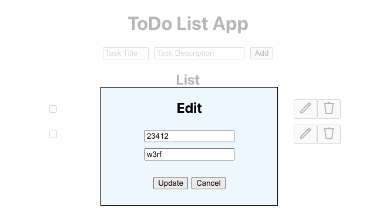

# ToDo List App

## Requirements
UI shall contain a list of todo items and controls to modify the list:

- You can add an item with title + description to the todo list
- You can remove an item
- You can edit the description and title
- You can mark it done, when done its not editable

## Design
Components:

1. Title
2. 'Add' form: including title and description, adding new ToDo's
3. ToDo row: card view with title and description, and has 'done' checkbox, edit button and delete button

## Preview
Main:

Edit modal:
